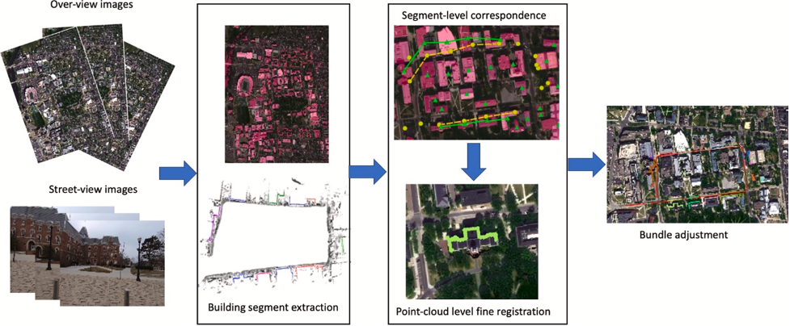

# graph-matching-based-crossview-registration

This is the offical repository of the paper:

**A graph-matching approach for cross-view registration of over-view and street-view based point clouds**

[J.ISPRS](https://www.sciencedirect.com/science/article/abs/pii/S0924271622000065) | [Arxiv](https://arxiv.org/abs/2202.06857)

## Abstract 

Wide-area 3D data generation for complex urban environments often needs to leverage a mixed use of data collected from both air and ground platforms, such as from aerial surveys, satellite, and mobile vehicles. On one hand, such kind of data with information from drastically different views (ca. 90° and more) forming cross-view data, which due to very limited overlapping region caused by the drastically different line of sight of the sensors, is difficult to be registered without significant manual efforts. On the other hand, the registration of such data often suffers from non-rigid distortion of the street-view data (e.g., non-rigid trajectory drift), which cannot be simply rectified by a similarity transformation. In this paper, based on the assumption that the object boundaries (e.g., buildings) from the over-view data should coincide with footprints of façade 3D points generated from street-view photogrammetric images, we aim to address this problem by proposing a fully automated geo-registration method for cross-view data, which utilizes semantically segmented object boundaries as view-invariant features under a global optimization framework through graph-matching: taking the over-view point clouds generated from stereo/multi-stereo satellite images and the street-view point clouds generated from monocular video images as the inputs, the proposed method models segments of buildings as nodes of graphs, both detected from the satellite-based and street-view based point clouds, thus to form the registration as a graph-matching problem to allow non-rigid matches; to enable a robust solution and fully utilize the topological relations between these segments, we propose to address the graph-matching problem on its conjugate graph solved through a belief-propagation algorithm. The matched nodes will be subject to a further optimization to allow precise-registration, followed by a constrained bundle adjustment on the street-view image to keep 2D-3D consistencies, which yields well-registered street-view images and point clouds to the satellite point clouds. Our proposed method assumes no or little prior pose information (e.g. very sparse locations from consumer-grade GPS (global positioning system)) for the street-view data and has been applied to a large cross-view dataset with significant scale difference containing 0.5 m GSD (Ground Sampling Distance) satellite data and 0.005 m GSD street-view data, 1.5 km in length involving 12 GB of data. The experiment shows that the proposed method has achieved promising results (1.27 m accuracy in 3D), evaluated using collected LiDAR point clouds. Furthermore, we included additional experiments to demonstrate that this method can be generalized to process different types of over-view and street-view data sources, e.g., the open street view maps and the semantic labeling maps.

## Workflow



## TODO

Note that, the current project has only been tested on Visual Studio 2017. More platforms will be supported in the future.

- [x] release the module for building extraction 
- [x] release the module for point cloud registration 
- [x] release the module for bundle adjustment 
- [x] release the sample program "test_alignment" 
- [ ] release the test dataset
- [ ] rewrite registration part for better performance
- [ ] release the documentation

## Reference
```
@article{Ling_2022_JISPRS,
title = {A graph-matching approach for cross-view registration of over-view and street-view based point clouds},
journal = {ISPRS Journal of Photogrammetry and Remote Sensing},
volume = {185},
pages = {2-15},
year = {2022},
author = {Xiao Ling and Rongjun Qin},
}
```

